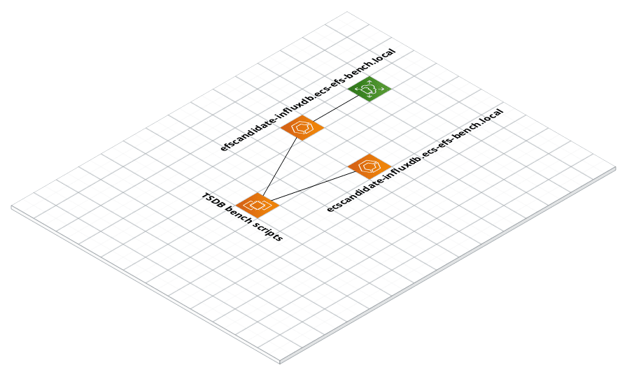

# InfluxDB Performance: EFS vs. ECS Storage

This repository contains the infrastructure to perform a benchmark of InfluxDB deployed on ECS-Fargate using either
* EFS _or_
* ECS-Volume 

storage.

The results are published [on medium.com](https://www.medium.com/).

## Setup

This will create a EFS resource, two ECS services in once ECS cluster and an EC2 instance. 
Additionally there will be security groups configured & a VPC created to place all resources inside.



Please review `infra/variables.tf` and verify the region & the sizing of the ECS container.

Note: A SSH public key must exist under `~/.ssh/id_rsa.pub`

```BASH
cd infra
terraform init
terraform apply
```


## Execution

Use the Terraform output of `ec2_ssh` to connect to the EC2 instance to run the benchmark:

### Installation

To install TSBS please follow the [README.md](https://github.com/timescale/tsbs#installation):

```bash
go get github.com/timescale/tsbs
cd go/src/github.com/timescale/tsbs/cmd
go get ./...
go install ./...
```

### Data Generation
Again, please follow the [README.md](https://github.com/timescale/tsbs#data-generation):

```bash
export PATH=~/go/bin:$PATH

tsbs_generate_data --use-case="devops" --seed=42 --scale=400 --timestamp-end="2016-01-02T00:00:00Z" --timestamp-start="2016-01-01T00:00:00Z"  --log-interval="10s" --format="influx" | /tmp/influx-data.gz
```

### Running the `insert` load:

For `INFLUXDB_HOST` please consult the Terraform output. It should be one of
* `ecscandidate-influxdb.ecs-efs-bench.local` _or_
* `efscandidate-influxdb.ecs-efs-bench.local`

```bash
export PATH=~/go/bin:$PATH
cd go/src/github.com/timescale/tsbs/ 

NUM_WORKERS=2 BATCH_SIZE=10000 BULK_DATA_DIR=/tmp DATABASE_HOST=$INFLUXDB_HOST  scripts/load_influx.sh
```

